# Dự báo nhiệt độ Hà Nội trong 1h, 6h, 12h, 24h tới — Xử lý dữ liệu

> Đồ án môn **Khoa học Dữ liệu**. Tài liệu này trình bày toàn bộ quy trình biến dữ liệu khí tượng thô theo giờ thành dữ liệu **đã chuẩn hóa, sẵn sàng đưa vào mô hình** (Linear Regression, LSTM, GRU). Mỗi thao tác đều ghi rõ **làm gì – vì sao – kết quả**. Phần mô hình chưa triển khai.

| Hạng mục | Giá trị |
|---|---|
| Nguồn | NASA POWER, API theo giờ, điểm Hà Nội (21.0285°N, 105.8542°E) |
| Thời gian | 01/01/2001 07:00 → 01/01/2026 06:00 (GMT+7), **25 năm** |
| Số dòng thô | **219.144 giờ** (= 9.131 ngày × 24), 7 biến khí tượng |
| Thiếu / trùng / lỗi | 0 giờ thiếu · 0 dòng trùng · 0 ô lỗi (đã kiểm tra, xem mục 4) |
| Bài toán | Hồi quy nhiều đầu ra: `T2M` tại t+1h, t+6h, t+12h, t+24h |
| Mẫu sau xử lý | train **157.698** · val **26.280** · test **35.047** |
| Đặc trưng | 13 đặc trưng theo giờ cho LSTM/GRU (cửa sổ 48h) · 26 đặc trưng dạng bảng cho Linear Regression |

---

## 1. Bài toán

Tại thời điểm **t**, dùng dữ liệu khí tượng **đến hết giờ t** để dự đoán nhiệt độ 2 m (`T2M`) tại **t+1h, t+6h, t+12h, t+24h**.

- Mỗi dòng dữ liệu là một giờ tại một điểm lưới NASA POWER đại diện cho Hà Nội (không phải trạm đo vật lý).
- Bốn horizon được đặt chung trong một bảng: **cùng một tập mẫu** cho cả 4 nhãn và cả 3 mô hình, nên so sánh LR/LSTM/GRU là công bằng.
- Ràng buộc quan trọng nhất của dữ liệu chuỗi thời gian: **không được để thông tin tương lai rò rỉ vào đầu vào** (data leakage). Mọi quyết định bên dưới đều kiểm tra ràng buộc này.

## 2. Dữ liệu nguồn

- Nhà cung cấp: **NASA Langley Research Center – dự án [POWER](https://power.larc.nasa.gov/)**, API [Hourly](https://power.larc.nasa.gov/docs/services/api/temporal/hourly/), `community=RE`, `time-standard=UTC`.
- Script tải: [src/data_collection/nasa_power.py](src/data_collection/nasa_power.py) (gọi API công khai, không cần key).
- Bản sao 25 năm đầy đủ, giá trị chưa chỉnh sửa, có sẵn trong repo: [outputs/timeseries_quality_v2/](outputs/timeseries_quality_v2/) — pipeline tự dùng bản này nếu chưa tải `data/raw/`.

| Mã | Ý nghĩa | Đơn vị | Vai trò |
|---|---|---|---|
| `T2M` | Nhiệt độ không khí ở 2 m | °C | đầu vào + **nhãn** |
| `PRECTOTCORR` | Lượng mưa (đã hiệu chỉnh) | mm/giờ | đầu vào |
| `RH2M` | Độ ẩm tương đối ở 2 m | % | đầu vào |
| `PS` | Áp suất bề mặt | kPa | đầu vào |
| `WS2M` | Tốc độ gió ở 2 m | m/s | đầu vào |
| `WD2M` | Hướng gió ở 2 m (hướng gió **thổi đến từ**, 0° = Bắc) | độ | đầu vào (sau mã hóa) |
| `ALLSKY_SFC_SW_DWN` | Bức xạ sóng ngắn xuống bề mặt | Wh/m² | đầu vào |

Các cột `city`, `latitude`, `longitude` là hằng số (một điểm duy nhất) → không mang thông tin, không đưa vào mô hình.

## 3. Quy trình tổng thể

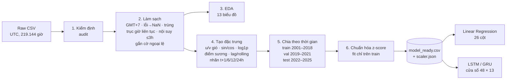

### Cách chạy lại

Cần Python ≥ 3.11 và `pip install -r requirements.txt` (chỉ dùng `pandas`, `numpy`, `matplotlib` cho phần dữ liệu). Chạy từ thư mục gốc repo, lần lượt:

```bash
python -m src.preprocessing.cleaning
```

```bash
python -m src.preprocessing.features
```

```bash
python -m src.visualization.plots
```

(Tùy chọn) tải lại dữ liệu gốc từ NASA trước bước 1: `python -m src.data_collection.nasa_power --start 2001-01-01 --end 2025-12-31`.

| Bước | Đầu ra | Ghi chú |
|---|---|---|
| Làm sạch | `data/cleaned/nasa_power/hanoi_hourly_20010101_20251231_clean.csv` + `_outlier_flags.csv` + `.metadata.json` | 219.144 dòng, GMT+7 |
| Đặc trưng | `data/processed/nasa_power/hanoi_t2m_model_ready.csv`, `scaler.json`, `.metadata.json` | 219.144 dòng × 32 cột |
| Biểu đồ | [outputs/figures/](outputs/figures/) | 13 file PNG |
| Báo cáo | [outputs/reports/](outputs/reports/) (`cleaning_report.json`, `features_report.json`, `scaler.json`, `descriptive_statistics.csv`) | bản nhỏ, lưu trong Git |

`data/` bị `.gitignore` bỏ qua vì dung lượng lớn; chạy 3 lệnh trên để tạo lại (≈1 phút).

---

## 4. Bước 1 — Kiểm định dữ liệu thô (audit)

**Làm gì:** đọc mọi cột dưới dạng **chuỗi** (không để pandas tự đoán), rồi đếm từng loại lỗi trước khi sửa bất cứ thứ gì.

**Vì sao:** `df.isna()` sau khi đọc CSV không đủ. Ô trống, chữ lẫn trong cột số, `-999` (giá trị thay thế của NASA khi không có số liệu) hay **mất nguyên một dòng giờ** đều không hiện thành NaN.

| Kiểm tra | Kết quả |
|---|---|
| Số dòng / số giờ kỳ vọng | 219.144 / 219.144 |
| Dòng trùng toàn bộ / trùng timestamp | 0 / 0 |
| Ô trống / không đọc được thành số | 0 / 0 |
| Giá trị thay thế `-999` | 0 |
| Giờ bị thiếu trên trục thời gian | 0 |
| Giá trị ngoài miền vật lý | 0 |
| `WD2M = 360` | 0 |

Thống kê mô tả (sau làm sạch — giống hệt dữ liệu thô vì không có ô nào phải sửa):

| | T2M (°C) | Mưa (mm/h) | RH (%) | PS (kPa) | WS (m/s) | WD (°) | Bức xạ (Wh/m²) |
|---|---|---|---|---|---|---|---|
| mean | 23,33 | 0,19 | 82,38 | 100,10 | 1,74 | 135,3 | 155,8 |
| std | 6,22 | 0,55 | 14,56 | 0,73 | 1,03 | 86,9 | 228,2 |
| min | 1,53 | 0 | 17,04 | 97,27 | 0 | 0 | 0 |
| median | 24,65 | 0,01 | 86,52 | 100,05 | 1,49 | 135,6 | 5,5 |
| max | 41,92 | 30,90 | 100 | 103,05 | 11,64 | 359,9 | 1020,8 |

> Dữ liệu hiện tại sạch, nhưng pipeline vẫn cài đủ các bước xử lý bên dưới để **an toàn khi tải lại** (NASA có thể cập nhật/thiếu dữ liệu). Mọi bước đều có unit test với dữ liệu cố tình làm hỏng ([tests/test_cleaning.py](tests/test_cleaning.py)).

## 5. Bước 2 — Làm sạch dữ liệu

Code: [src/preprocessing/cleaning.py](src/preprocessing/cleaning.py). Hằng số: [src/preprocessing/config.py](src/preprocessing/config.py).

### 5.1. Chuyển UTC → giờ Việt Nam (GMT+7)

- **Làm gì:** đổi múi giờ thật sự (`00:00Z` → `07:00+07:00`), không chỉ đổi nhãn. Từ chối timestamp không có múi giờ hoặc lệch phút.
- **Vì sao:** nhiệt độ phụ thuộc giờ mặt trời địa phương. Ở UTC, "0 giờ" thực ra là 7 giờ sáng Hà Nội; đặc trưng "giờ trong ngày" sẽ lệch 7 tiếng và gom sai ngày/tháng ở biên. Biểu đồ 3 cho thấy đỉnh nhiệt lúc 13–14h, đáy lúc 5–6h giờ VN.
- **Kết quả:** chuỗi bắt đầu 01/01/2001 07:00 và kết thúc 01/01/2026 06:00 — 7 giờ đầu năm 2026 là cùng dữ liệu nguồn năm 2025 sau khi đổi giờ, không phải dữ liệu thêm.

### 5.2. Giá trị không hợp lệ → NaN

- **Làm gì:** ô trống, không phải số, ±∞, `-999`/`-99`, hoặc nằm **ngoài miền vật lý có thể xảy ra** được đổi thành NaN (xử lý ở 5.6).

  | Biến | Miền chấp nhận | Lý do |
  |---|---|---|
  | T2M | −10 … 50 °C | rộng hơn xa mọi kỷ lục ở Hà Nội |
  | PRECTOTCORR | 0 … 200 mm/h | mưa không âm; kỷ lục thế giới ~300 mm/h |
  | RH2M | 0 … 100 % | định nghĩa độ ẩm tương đối |
  | PS | 90 … 110 kPa | Hà Nội gần mực nước biển (~100 kPa) |
  | WS2M | 0 … 75 m/s | tốc độ gió không âm |
  | WD2M | 0 … 360° | định nghĩa góc |
  | ALLSKY_SFC_SW_DWN | 0 … 1400 Wh/m² | không vượt hằng số mặt trời ~1361 W/m² |

- **Vì sao dùng miền *vật lý* chứ không dùng miền *thường gặp*:** giá trị 40°C hay 30 mm/giờ hiếm nhưng **có thật** (nắng nóng, bão). Cắt theo ngưỡng "thường gặp" sẽ xóa đúng những sự kiện mà mô hình cần học. Chỉ những giá trị *không thể tồn tại* mới là lỗi.
- **Kết quả:** 0 ô bị đổi.

### 5.3. Hướng gió 360° → 0°

- **Làm gì:** gán `WD2M = 360` thành `0`.
- **Vì sao:** 360° và 0° là **cùng một hướng (Bắc)**. Giữ cả hai tạo ra hai giá trị khác nhau cho cùng một hiện tượng. (Vấn đề sâu hơn — 359° và 1° bị coi là xa nhau — được giải quyết ở bước tạo đặc trưng, mục 7.1.)
- **Kết quả:** 0 ô (NASA đã trả về miền [0, 360)).

### 5.4. Bản ghi trùng lặp

- **Làm gì:** dòng trùng y hệt → giữ một; hai dòng **cùng giờ nhưng khác giá trị** → dừng pipeline và báo lỗi.
- **Vì sao:** không có căn cứ để chọn một trong hai giá trị mâu thuẫn; lấy trung bình là bịa ra dữ liệu. Phải đối chiếu lại nguồn.
- **Kết quả:** 0 dòng trùng.

### 5.5. Trục thời gian liên tục

- **Làm gì:** sắp xếp theo thời gian, tạo trục đủ mọi giờ từ đầu đến cuối, giờ bị thiếu được chèn vào với NaN và cờ `is_inserted_hour = 1`.
- **Vì sao:** lag, rolling và cửa sổ LSTM đều giả định **dòng kế tiếp = 1 giờ sau**. Mất một dòng mà không chèn thì `lag_24h` thực ra là 25 giờ trước, cửa sổ 48 dòng thực ra dài 49 giờ — sai lặng lẽ, không báo lỗi.
- **Kết quả:** 0 giờ chèn thêm; bước khoảng cách giữa mọi dòng đúng 1 giờ.

### 5.6. Giá trị thiếu

- **Làm gì:**
  - Khoảng thiếu **≤ 3 giờ liên tiếp**: nội suy tuyến tính theo thời gian. Hướng gió nội suy qua thành phần (sin, cos) để 350° → 10° đi qua 0° (Bắc), không quét ngược qua 180°.
  - Khoảng thiếu **> 3 giờ**: giữ NaN, không bịa dữ liệu.
  - Ô được điền có cờ `is_imputed = 1` và `imputed_columns`.
  - Ở bước tạo mẫu: **mọi mẫu có cửa sổ [t−47h, t+24h] chạm vào giờ được điền/chèn/thiếu đều bị loại**.
- **Vì sao:**
  - Thời tiết thay đổi mượt trong vài giờ nên nội suy ngắn hợp lý; nhưng 1 ngày thiếu thì nội suy đường thẳng sẽ xóa mất chu kỳ ngày–đêm.
  - Nội suy dùng cả giá trị *sau* khoảng trống → nếu để giờ được nội suy nằm trong đầu vào thì mô hình gián tiếp "nhìn thấy tương lai". Nếu nằm ở nhãn thì ta đang chấm điểm mô hình bằng giá trị tự bịa. Loại cả cửa sổ giải quyết cả hai.
  - Không dùng "điền 0 cho mưa": mưa thiếu không có nghĩa là không mưa.
- **Kết quả:** 0 ô thiếu → 0 ô được điền, 0 mẫu bị loại vì lý do này.

### 5.7. Ngoại lệ (outlier): gắn cờ, **không xóa**

- **Làm gì:**
  - Tính **robust z-score theo nhóm (tháng, giờ địa phương)**: `z = |x − median| / (1,4826 × MAD)`; gắn cờ khi `z > 5`. Áp dụng cho T2M, RH2M, PS, WS2M, bức xạ.
  - Mưa có 46% số giờ bằng 0 nên MAD ≈ 0 → dùng ngưỡng phân vị 99,9% của các giờ có mưa (> 8,5 mm/giờ).
  - Kiểm tra bước nhảy vật lý: T2M thay đổi > 8°C trong 1 giờ.
  - Kết quả lưu vào `*_outlier_flags.csv` và cột `outlier_flags`; **giá trị giữ nguyên**.
- **Vì sao theo nhóm (tháng, giờ) mà không dùng IQR toàn cục:** 12°C là bình thường cho sáng tháng 1 nhưng bất thường cho trưa tháng 6. Biểu đồ 4: IQR toàn cục coi **1.017 giờ** là ngoại lệ, **96% trong đó là giờ mùa đông bình thường**; robust z theo nhóm chỉ còn 44 giờ. Dùng MAD thay độ lệch chuẩn vì chính các ngoại lệ làm phình độ lệch chuẩn.
- **Vì sao không xóa:** NASA POWER là dữ liệu tái phân tích (mô hình đồng hóa số liệu quan trắc), không có lỗi cảm biến kiểu nhiễu đột biến. Kiểm tra từng sự kiện bị gắn cờ cho thấy đó là **thời tiết thật**, các biến khớp nhau về vật lý (biểu đồ 5):
  - **Đợt rét lịch sử 24/01/2016:** T2M xuống ~2°C đúng lúc áp suất lên cực đại 103,05 kPa (khối không khí lạnh áp cao tràn về).
  - **Bão Yagi 07/09/2024:** gió đạt cực đại 11,6 m/s đúng lúc áp suất xuống thấp nhất và mưa lớn nhất.

  Xóa chúng làm mô hình kém ở đúng những ngày người dùng cần dự báo nhất.
- **Kết quả:** 4.692 ô gắn cờ robust z (phần lớn là gió và độ ẩm trong bão/gió mùa), 58 giờ mưa cực lớn, 0 bước nhảy nhiệt độ bất khả thi, **0 giá trị bị xóa**.

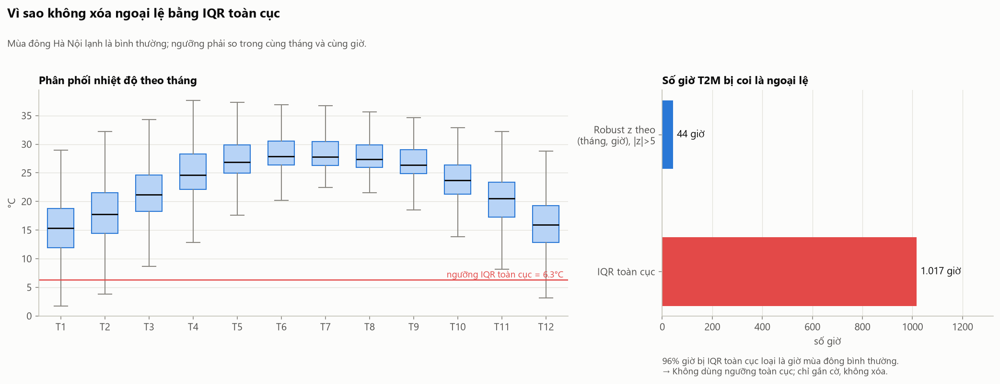
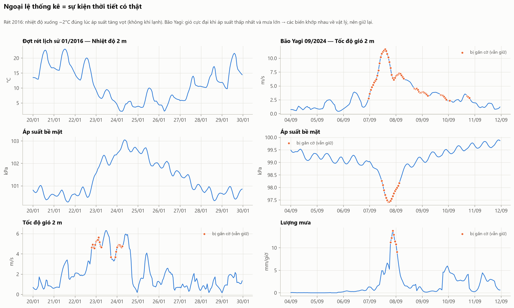

### 5.8. Những thứ cố ý **không** làm

| Không làm | Lý do |
|---|---|
| Làm mượt (smoothing) nhiệt độ, mưa | Mất tín hiệu thật (đỉnh nóng, mưa rào) mà mô hình cần dự báo |
| Ép bức xạ ban đêm về 0 bằng góc mặt trời | Dữ liệu đã bằng 0 từ 19h đến 4h (đã kiểm tra); thêm thư viện `pvlib` là thừa |
| Xóa các giờ RH = 100% (8.945 giờ) | Bão hòa hơi nước là hiện tượng thật (sương mù, mưa phùn mùa xuân) |
| Chia ngẫu nhiên train/test | Rò rỉ dữ liệu: giờ kề nhau gần như giống hệt (tự tương quan lag 1h = 0,99) |
| Fit thống kê trên toàn bộ dữ liệu | Ngưỡng ngoại lệ chỉ dùng để *báo cáo*; scaler fit **chỉ trên train** (mục 9) |

---

## 6. Bước 3 — Phân tích khám phá (EDA)

Code: [src/visualization/plots.py](src/visualization/plots.py). Mỗi biểu đồ trả lời một câu hỏi dẫn tới một quyết định xử lý.

**Dữ liệu có ổn định suốt 25 năm không?** Chu kỳ năm đều đặn, không có đoạn đứt, bước nhảy mức hay giá trị hằng kéo dài → không cần xử lý thay đổi phương pháp đo.

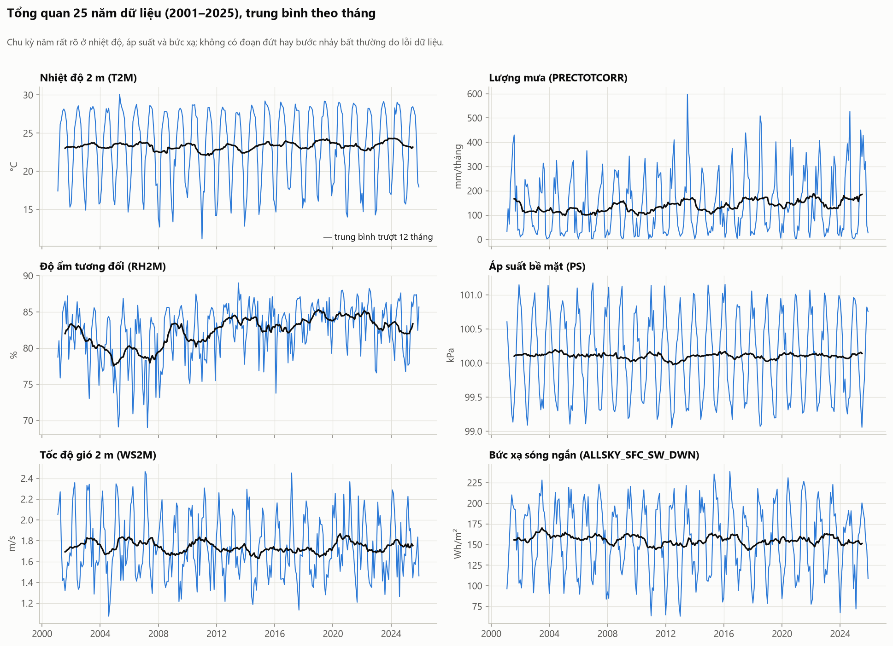

**Phân phối các biến trông thế nào?** Mưa lệch phải rất mạnh (skew 8,3) → cần `log1p`. Bức xạ có cột 0 rất cao (ban đêm). Hướng gió có hai đỉnh và dồn về hai đầu 0°/360° → dấu hiệu cần mã hóa vòng tròn.

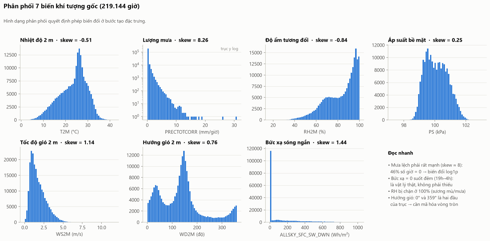

**Nhiệt độ phụ thuộc thời gian như thế nào?** Hai chu kỳ lồng nhau: ngày (biên độ 6–9°C) và năm (mùa đông lạnh hơn mùa hạ ~12°C) → cần đặc trưng giờ và ngày-trong-năm.

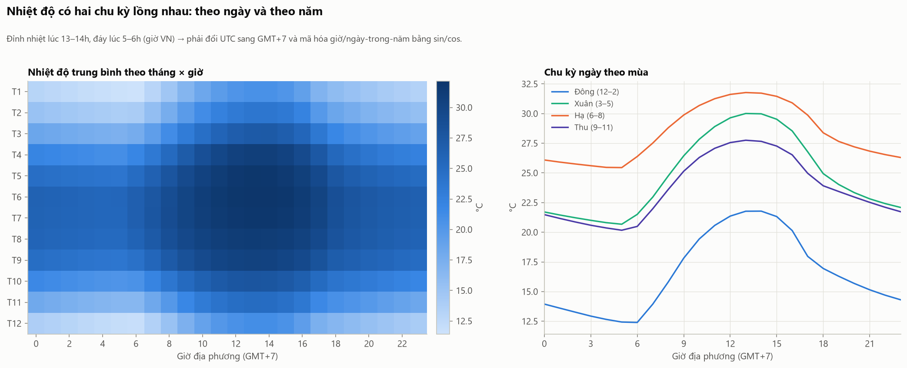

**Cần nhìn lại bao xa?** Tự tương quan có đỉnh lặp mỗi 24h (lag 24h = 0,95; lag 48h = 0,89), thấp nhất ở lag 12h (0,55) → chọn lag 1, 2, 3, 6, 12, 24h cho LR và cửa sổ **48h = 2 chu kỳ ngày** cho LSTM/GRU.

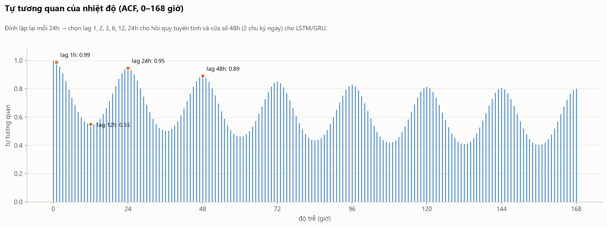

**Bốn horizon khó dễ ra sao?** Càng xa càng phân tán, *trừ* 24h: nhiệt độ ngày mai cùng giờ rất giống hôm nay (r = 0,95) trong khi 12h sau là đầu kia của chu kỳ ngày (r = 0,55). Vì vậy mỗi horizon có nhãn riêng và phải đánh giá riêng.

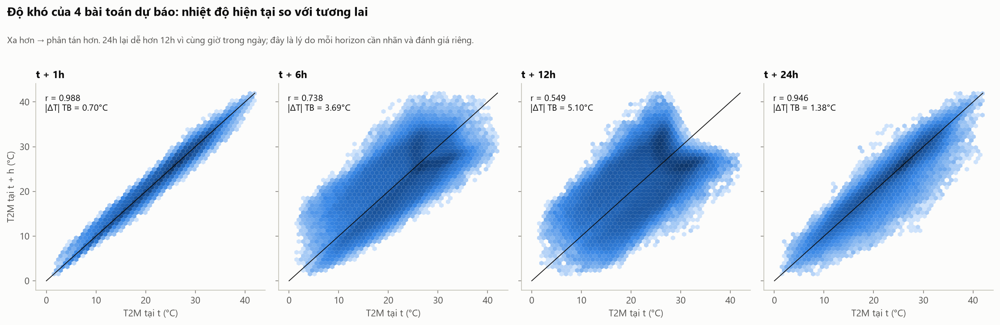

---

## 7. Bước 4 — Tạo đặc trưng và nhãn

Code: [src/preprocessing/features.py](src/preprocessing/features.py). Nguyên tắc: **đặc trưng tại dòng t chỉ dùng các giờ ≤ t** (có unit test: thay đổi dữ liệu tương lai không làm đổi đặc trưng hiện tại).

### 7.1. Hướng gió → vector gió (u, v)

**Vấn đề.** `WD2M` là một **góc**. Về bản chất 359° và 1° chỉ lệch 2°, nhưng với mô hình chúng là hai số cách nhau 358 — mô hình tuyến tính sẽ coi gió Bắc-hơi-Tây và gió Bắc-hơi-Đông là hai thái cực đối lập, còn 180° (gió Nam) nằm "ở giữa" chúng. Không phép chuẩn hóa tuyến tính nào sửa được điều này vì vấn đề nằm ở **topo** (đường thẳng so với vòng tròn).

**Có hai cách mã hóa vòng tròn:**

1. `sin(WD)`, `cos(WD)`: đặt góc lên vòng tròn đơn vị → 359° và 1° gần nhau (khoảng cách 0,03 thay vì 358).
2. **Vector gió** `u = −WS·sin(WD)`, `v = −WS·cos(WD)`: như cách 1 nhưng nhân với tốc độ gió. Dấu trừ vì hướng gió khí tượng là hướng gió **thổi đến từ**; `u > 0` = gió đi về phía Đông, `v > 0` = gió đi về phía Bắc.

**Chọn cách 2**, vì khi gió lặng (4,2% số giờ có WS < 0,5 m/s) hướng gió gần như ngẫu nhiên — trung bình đổi 35° mỗi giờ, so với ~5° khi gió mạnh (biểu đồ 6, panel phải). Với sin/cos, hướng nhiễu đó vẫn nặng ngang hướng của gió bão. Với (u, v), gió lặng tự động ≈ (0, 0). Đây cũng là cách biểu diễn gió chuẩn trong khí tượng học.

**Có đáng giữ hướng gió không?** Có: hoa gió (biểu đồ 7) cho thấy gió mùa Đông Bắc mang không khí lạnh vào mùa đông, gió Đông Nam ẩm vào mùa hạ — hướng gió báo hiệu khối khí sắp tới, rất có ích cho horizon 12–24h. `WS2M` vẫn được giữ riêng vì cường độ gió ảnh hưởng xáo trộn nhiệt bất kể hướng. Cột `WD2M` gốc **không** đưa vào mô hình.

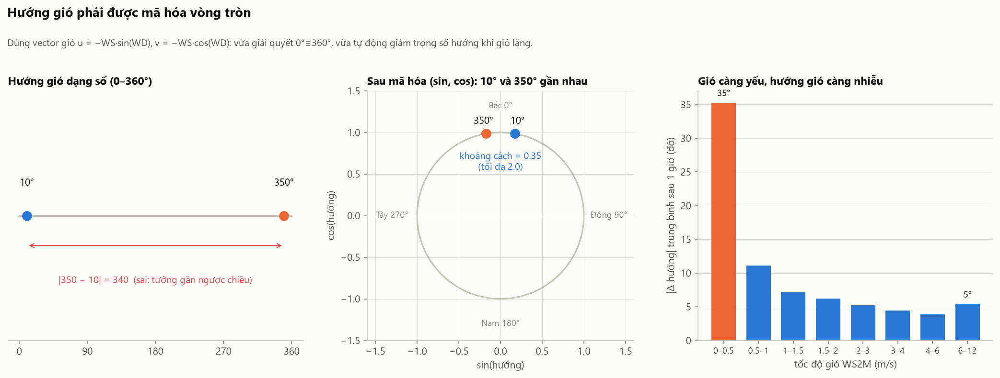
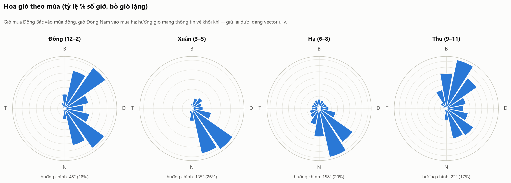

### 7.2. Giờ trong ngày và ngày trong năm → sin/cos

- `hour_sin = sin(2π·giờ/24)`, `hour_cos = cos(2π·giờ/24)`; `doy_sin/doy_cos` tương tự với chu kỳ 365,25 ngày.
- **Vì sao:** cùng vấn đề vòng tròn như hướng gió: 23h và 0h liền nhau nhưng là hai số 23 và 0; 31/12 và 01/01 liền nhau nhưng là 365 và 1. Một cặp (sin, cos) — không phải chỉ sin — vì sin một mình cho 6h và 18h cùng giá trị.
- **Không dùng** cột số `month`, `dayofweek`, `season` dạng số nguyên của pipeline cũ: `month` có lỗi 12→1 như trên; `season` (0–3) áp thứ tự giả cho các mùa; `dayofweek` không có cơ chế vật lý nào làm thứ Hai nóng hơn Chủ nhật — chỉ thêm nhiễu.

### 7.3. Lượng mưa → log1p

- `PRECTOTCORR_log1p = log(1 + mưa)`.
- **Vì sao:** phân phối lệch phải cực mạnh (46% giờ bằng 0, max 30,9 mm/giờ, skew 8,3). Với hồi quy tuyến tính, vài giờ mưa cực lớn chi phối hệ số; với LSTM/GRU, chúng gây gradient lớn. `log1p` giữ 0 → 0 (không như `log`), giảm skew xuống 3,3 và vẫn giữ thứ tự.

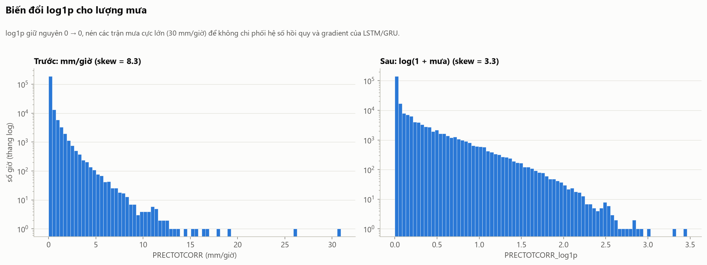

### 7.4. Điểm sương (đặc trưng vật lý dẫn xuất)

- `DEWPOINT` tính từ T2M và RH2M theo công thức Magnus.
- **Vì sao:** RH phụ thuộc mạnh vào chính nhiệt độ (trời nóng lên thì RH giảm dù lượng hơi nước không đổi). Điểm sương đo **lượng hơi nước thực** trong không khí và là cận dưới của nhiệt độ ban đêm — hữu ích cho dự báo 12–24h. Tương quan với nhãn ổn định 0,78–0,84 ở mọi horizon (biểu đồ 11), trong khi RH dao động −0,29 … 0,45.

### 7.5. Lag và thống kê trượt (chỉ cần cho Linear Regression)

| Đặc trưng | Ý nghĩa | Lý do |
|---|---|---|
| `T2M_lag_{1,2,3,6,12,24}h` | Nhiệt độ k giờ trước | Hồi quy tuyến tính chỉ thấy **một dòng**; lịch sử phải được đưa vào thành cột. Các lag chọn theo ACF (biểu đồ 9) |
| `T2M_roll_mean/min/max_24h` | Trung bình, thấp nhất, cao nhất 24h qua | Mức nhiệt và biên độ ngày gần nhất |
| `PS_diff_3h`, `PS_diff_24h` | Xu hướng áp suất | Áp suất tăng nhanh báo hiệu không khí lạnh tràn về (như 01/2016) |
| `PRECTOTCORR_sum_24h_log1p` | Tổng mưa 24h (log1p) | Đất ướt, trời âm u → nhiệt độ thấp hơn |
| `ALLSKY_sum_24h` | Tổng bức xạ 24h | Đại diện độ mây che phủ của ngày qua |

Mọi cửa sổ rolling **kết thúc tại t** (bao gồm t, không vượt t). LSTM/GRU không cần các cột này vì tự học từ cửa sổ 48 giờ.

Biểu đồ 11 cho thấy mỗi horizon dựa vào đặc trưng khác nhau: t+1h và t+24h ← `T2M` hiện tại; t+12h ← `T2M_lag_12h` (r = 0,95, vì cách thời điểm đích đúng 24h). Các lag tương quan rất cao với nhau (đa cộng tuyến) → khi làm Linear Regression nên cân nhắc **Ridge** để hệ số ổn định.

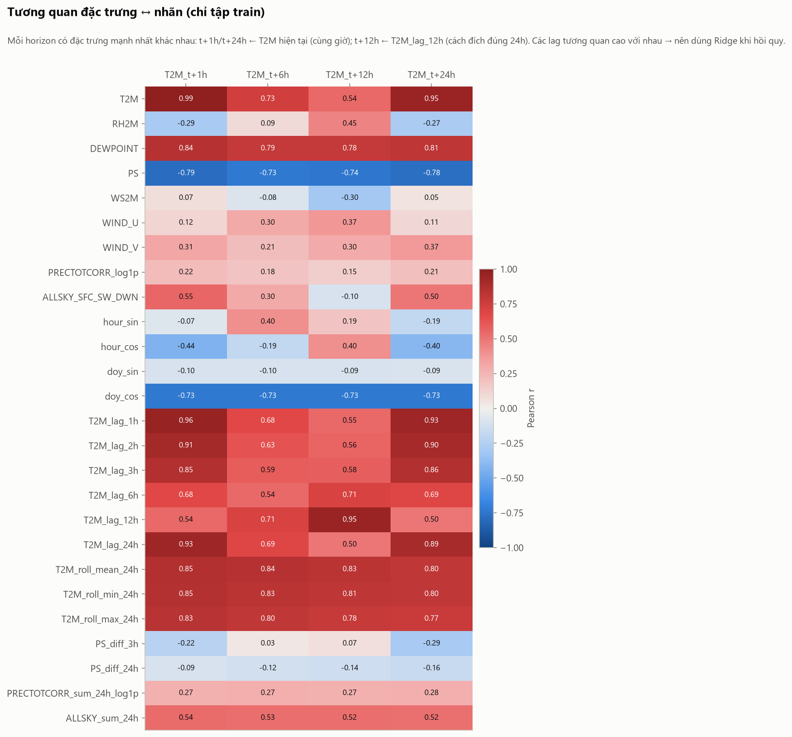

### 7.6. Nhãn (target)

- `T2M_t+1h`, `T2M_t+6h`, `T2M_t+12h`, `T2M_t+24h` = `T2M` dịch lên 1, 6, 12, 24 giờ.
- Đơn vị **°C, không chuẩn hóa** trong file (để tính MAE/RMSE dễ hiểu). Tham số chuẩn hóa nhãn cho LSTM/GRU có sẵn trong `scaler.json` → `__target__`.
- Không dự đoán độ chênh `T(t+h) − T(t)` ở bước dữ liệu; mô hình có thể tự biến đổi nếu muốn.

### 7.7. Danh sách đặc trưng cuối

| Nhóm | Cột | LSTM/GRU | LR |
|---|---|---|---|
| Khí tượng | `T2M`, `RH2M`, `DEWPOINT`, `PS`, `WS2M`, `WIND_U`, `WIND_V`, `PRECTOTCORR_log1p`, `ALLSKY_SFC_SW_DWN` | ✓ | ✓ |
| Thời gian | `hour_sin`, `hour_cos`, `doy_sin`, `doy_cos` | ✓ | ✓ |
| Lịch sử | 6 lag + 3 rolling + 2 xu hướng áp suất + 2 tổng 24h | — | ✓ |
| **Tổng** | | **13** | **26** |

## 8. Bước 5 — Chia train / validation / test theo thời gian

| Tập | Khoảng thời gian t | Số mẫu | Tỷ lệ |
|---|---|---|---|
| train | 03/01/2001 06:00 → 30/12/2018 23:00 | 157.698 | 72% |
| val | 01/01/2019 → 30/12/2021 23:00 | 26.280 | 12% |
| test | 01/01/2022 → 31/12/2025 06:00 | 35.047 | 16% |

- **Vì sao theo thời gian, không ngẫu nhiên:** nhiệt độ hai giờ liền nhau gần như bằng nhau (ACF = 0,99). Chia ngẫu nhiên thì giờ 13h nằm ở train còn 14h cùng ngày nằm ở test → điểm số đẹp giả tạo. Thực tế mô hình luôn dự báo **tương lai chưa từng thấy**.
- **Purge (bỏ vùng đệm):** mẫu cuối của train có nhãn t+24h; nếu t = 31/12/2018 12:00 thì nhãn rơi vào 2019 (thuộc val). Vì vậy **24 giờ cuối của train và val bị bỏ** — không giá trị nhãn nào xuất hiện ở hai tập.
- **Warm-up:** 47 giờ đầu tiên không đủ lịch sử cho cửa sổ 48h → bỏ (vì vậy train bắt đầu 03/01/2001 06:00). 24 giờ cuối cùng không có nhãn t+24h → bỏ. Tổng 119 dòng có `split = none`; chúng vẫn nằm trong file để cửa sổ LSTM của mẫu đầu val/test có thể nhìn lùi qua (đó là quá khứ đã biết, không phải rò rỉ).
- 4 năm test (2022–2025) bao gồm nhiều sự kiện cực đoan (bão Yagi 2024) → đánh giá khả năng tổng quát hóa thực sự.

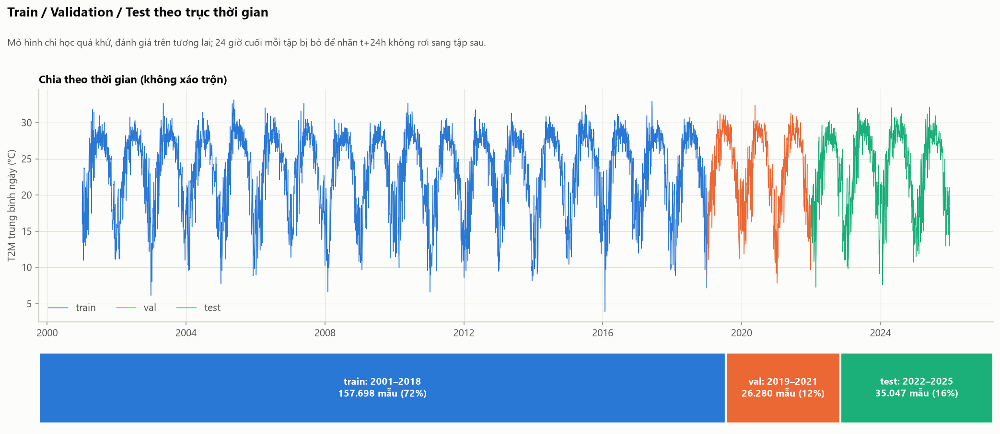

## 9. Bước 6 — Chuẩn hóa (z-score)

- **Làm gì:** `x' = (x − mean_train) / std_train` cho 22 đặc trưng liên tục. Tham số lưu ở `scaler.json` để áp dụng y hệt cho dữ liệu mới và đảo ngược.
- **Vì sao phải chuẩn hóa:** các đặc trưng chênh lệch thang đo hàng nghìn lần (áp suất ~100 nhưng chỉ dao động ±0,7; tổng bức xạ ~4.000; mưa log ~0,1 — biểu đồ 13).
  - **LSTM/GRU:** các cổng dùng sigmoid/tanh bão hòa khi đầu vào lớn → gradient biến mất; đặc trưng thang lớn lấn át phần còn lại.
  - **Linear Regression:** nghiệm OLS không đổi khi đổi thang, nhưng Ridge/Lasso phạt hệ số theo độ lớn (không công bằng nếu thang khác nhau), gradient descent hội tụ chậm, và hệ số chỉ **so sánh được với nhau** khi cùng thang.
- **Vì sao z-score mà không min-max:** min-max phụ thuộc vào 2 điểm cực trị — một cơn bão làm co toàn bộ phần dữ liệu thường về một khoảng hẹp. Hơn nữa test có thể vượt min/max của train (năm nóng hơn) → ra ngoài [0, 1]. z-score dựa trên trung bình và độ lệch chuẩn nên ổn định hơn với ngoại lệ đã được giữ lại.
- **Vì sao fit chỉ trên train:** mean/std tính trên cả val/test là dùng thông tin tương lai (rò rỉ). Kiểm chứng: sau chuẩn hóa, T2M trên train có mean 0,000/std 1,000, trên val 0,064/0,961, trên test 0,051/0,974 — lệch nhẹ là đúng, phản ánh 2019–2025 ấm hơn trung bình 2001–2018.
- **Không chuẩn hóa** `hour_sin/cos`, `doy_sin/cos`: đã nằm trong [−1, 1] và có ý nghĩa hình học (vị trí trên vòng tròn).

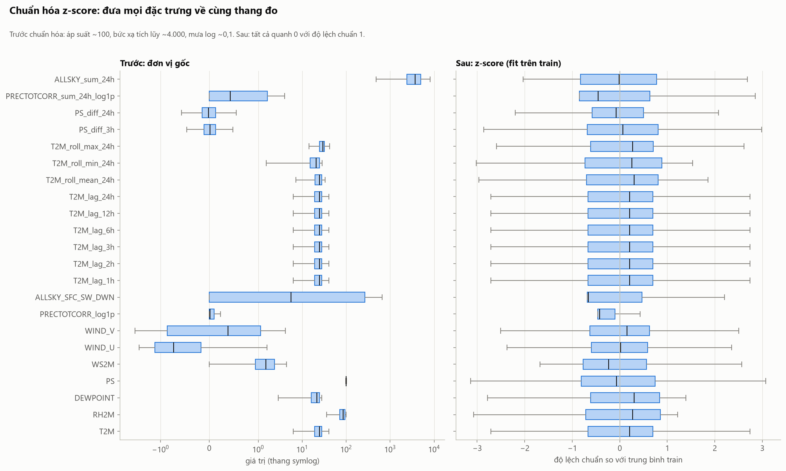

---

## 10. Dữ liệu đầu ra và cách dùng

`data/processed/nasa_power/hanoi_t2m_model_ready.csv` — một bảng **liên tục theo giờ** (219.144 dòng, 32 cột): `timestamp`, `split` (`train`/`val`/`test`/`none`), 26 đặc trưng đã chuẩn hóa, 4 nhãn (°C). Danh sách cột chính xác nằm trong `.metadata.json`; giải thích từng cột: [docs/processed_data_dictionary.md](docs/processed_data_dictionary.md).

Hàm đọc dữ liệu: [src/preprocessing/sequences.py](src/preprocessing/sequences.py).

```python
from src.preprocessing.sequences import load_model_ready, tabular_xy, make_sequences

df = load_model_ready()

# Linear Regression: mỗi dòng là một mẫu
X_train, y_train = tabular_xy(df, "train")   # (157698, 26), (157698, 4)
X_test,  y_test  = tabular_xy(df, "test")

# LSTM / GRU: cửa sổ 48 giờ × 13 đặc trưng
X_seq, y_seq, t = make_sequences(df, "train", scale_target=True)  # (157698, 48, 13), (157698, 4)
```

- `y` có 4 cột tương ứng 4 horizon: huấn luyện 1 mô hình nhiều đầu ra, hoặc 4 mô hình riêng.
- Với `scale_target=True`, đổi dự đoán về °C bằng `pred * std + mean` (lấy từ `target_scaler()`).
- Bộ nhớ: tập train dạng cửa sổ chiếm ~390 MB (float32). Nếu máy yếu, tạo cửa sổ theo batch hoặc dùng `torch.utils.data.Dataset` đọc từ cùng bảng.

## 11. Cấu trúc thư mục

```text
Weather-Prediction-ML/
├── data/                         # (gitignore) tạo lại bằng 3 lệnh ở mục 3
│   ├── raw/nasa_power/           # dữ liệu gốc UTC, không sửa
│   ├── cleaned/nasa_power/       # sau bước 2
│   └── processed/nasa_power/     # sau bước 4–6, sẵn sàng cho mô hình
├── docs/                         # từ điển dữ liệu, kế hoạch sprint
├── notebooks/                    # notebook audit chất lượng 25 năm (bản trước)
├── outputs/
│   ├── figures/                  # 13 biểu đồ trong README
│   ├── reports/                  # báo cáo JSON/CSV của pipeline
│   └── timeseries_quality_v2/    # bản sao dữ liệu 25 năm + kết quả audit cũ
├── src/
│   ├── data_collection/          # tải NASA POWER
│   ├── preprocessing/
│   │   ├── config.py             # mọi hằng số/ngưỡng
│   │   ├── cleaning.py           # bước 1–2
│   │   ├── features.py           # bước 4–6
│   │   └── sequences.py          # đọc dữ liệu cho LR / LSTM / GRU
│   ├── visualization/plots.py    # 13 biểu đồ
│   └── training/                 # (chưa triển khai) mô hình
└── tests/                        # unit test cho từng quy tắc xử lý
```

## 12. Kiểm thử

```bash
python -m unittest discover -s tests -v
```

Các test tạo dữ liệu giả có lỗi cố ý và kiểm tra: đổi múi giờ; từ chối timestamp không có múi giờ; `-999`/ngoài miền → NaN; nội suy chỉ khoảng ≤ 3h; chèn giờ thiếu; hướng gió nội suy qua 0° (không phải 180°); trùng lặp xung đột bị chặn; ngoại lệ được giữ; nhãn đúng t+h; đặc trưng không phụ thuộc tương lai; vector gió đúng quy ước; split đúng thứ tự và có purge; giờ được điền loại mọi cửa sổ chạm vào nó; scaler chỉ fit trên train; cửa sổ LSTM khớp đúng dữ liệu gốc.

## 13. Hạn chế

- Một điểm lưới đại diện cho cả Hà Nội; dữ liệu tái phân tích mượt hơn quan trắc trạm thực tế.
- Giả định dữ liệu giờ t có sẵn ngay tại t. Thực tế NASA POWER công bố trễ vài ngày → đây là đánh giá hồi cứu (backtest), chưa phải hệ thống dự báo thời gian thực.
- Ngưỡng ngoại lệ tính trên toàn kỳ chỉ dùng để báo cáo, không ảnh hưởng tới dữ liệu đưa vào mô hình.
